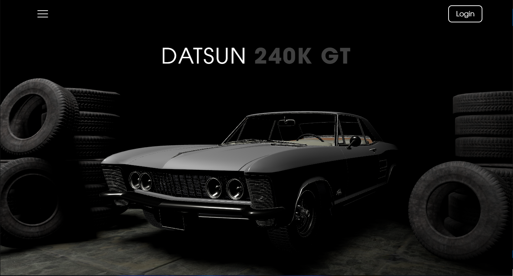

<h1 align="center">Car3D</h1>
<div align="center" id="top">

</div>
&#xa0;


<p align="center">
  

  

  

  

  
</p>


<p align="center">
  <a href="#dart-about">About</a> &#xa0; | &#xa0; 
  <a href="#sparkles-features">Features</a> &#xa0; | &#xa0;
  <a href="#rocket-technologies">Technologies</a> &#xa0; | &#xa0;
  <a href="#white_check_mark-requirements">Requirements</a> &#xa0; | &#xa0;
  <a href="#checkered_flag-starting">Starting</a> &#xa0; | &#xa0;
  <a href="#memo-license">License</a> &#xa0; | &#xa0;
  <a href="https://github.com/matmon12" target="_blank">Author</a>
</p>

<br>

## :dart: About

Website using the Three.js library. The 3D model is loaded, it is possible to change the body color. Implemented camera rotation around the model using input range. Tween.js animations are also used.

## :sparkles: Features

:heavy_check_mark: Changing the color of the car body;\
:heavy_check_mark: Animations;\
:heavy_check_mark: Optimization;\
:heavy_check_mark: Motion when moving the cursor;\
:heavy_check_mark: Rotating the camera using input range;\
:heavy_check_mark: Adaptive for mobile devices;

## :rocket: Technologies

The following tools were used in this project:

- [Three.js](https://threejs.org/)
- [Tween.js](https://github.com/tweenjs/tween.js)
- [Fullpage.js](https://alvarotrigo.com/fullPage/ru/)

## :white_check_mark: Requirements

Before starting :checkered_flag:, you need to have [Git](https://git-scm.com) and [Node](https://nodejs.org/en/) installed.

## :checkered_flag: Starting

```bash
# Clone this project
$ git clone https://github.com/matmon12/Car3D

# Access
$ cd Car3D

# Install dependencies
$ npm install

# Run the project
$ npm run start

# Compiles and minifies for production
$ npm run build-prod
```

## :memo: License

This project is under license from MIT. For more details, see the [LICENSE](LICENSE) file.

Made with :heart: by <a href="https://github.com/matmon12" target="_blank">Matmon</a>

&#xa0;

<a href="#top">Back to top</a>
